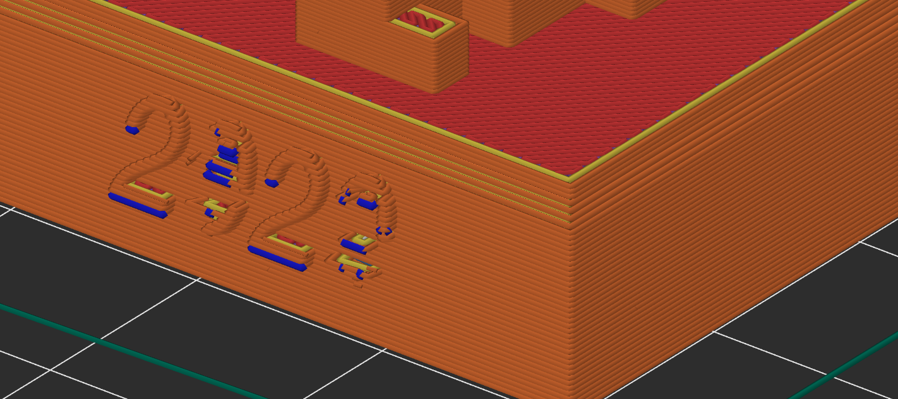

# skyline-clone
Clone of GitHub's "Skyline" 3D model generator - but this one uses OpenSCAD

This (tiny) project was created to get past some shortcomings of the [GitHub-generated skyline](https://skyline.github.com) stl:

  1. Minimize errors in file geometry
  2. Create printable file for most slicers without need for repair
  3. Allow end-users to customize the output
  4. Reduce print cost for powder-based printed parts. Comparing `original.js` with the `hollow_base_with_escape_hole.js` settings, using Shapeways and in Steel, resulted in a savings of $96.39 ($211.29 solid vs $114.90 hollow).

## Requirements

  1. Install [OpenSCAD](https://openscad.org)

      * OpenSCAD set up as `openscad` in your shell - see [Command Line Instructions](https://en.wikibooks.org/wiki/OpenSCAD_User_Manual/Using_OpenSCAD_in_a_command_line_environment)

  2. Install [node.js](https://nodejs.org/en/) (tested with 14, but should work with older and newer versions)

## Setup

  1. If you want to change some of the defaults, duplicate one of the files in the `overrides` folder and rename it. Modify the settings and choose it when you run the script.

  2. Install `node.js` dependencies

```shell
# install dependencies
npm i
```

## Running

```shell
# run
npm run start
```

## Customizing

Three default settings files are included in the `overrides` folder. Just duplicate the file you'd like to start with and make some changes. When the script runs it checks the `overrides` directory for any `.js` files and let's you choose one of them to use.

After exporting, you can open the exported `.scad` file and customize iit directly in OpenSCAD.

## Notes

I did this more for the challenge and so I could print one for a coworker/friend. My public commit history is pathetic, this wasn't to make one for myself. However, when I went to slice the Skyline-generated file in PrusaSlicer, the chosen font / text presented a problem:



The year 2020 did not slice well - which pretty much sums up 2020. Perhaps a different font or variant of this font (Helvetica) would slice better with my nozzle size (.4mm). Sure, I could scale up the design, but that means longer printing times and with how wide it is already, I could only increase the size so much. A simple font-chooser or choice of a different font (say, Helvetica Bold) might remedy this problem for most users, but I could not find a repository for skyline to do a pull request against (ermm...) or file an issue, hence this repo.

The next image shows what OpenSCAD generated for me - with "Helvetica Neue:style=Bold" as the font. You may not have this particular font on your system, [check out the wiki for help in choosing a font](https://en.wikibooks.org/wiki/OpenSCAD_User_Manual/Text).
!
[Image showing properly sliced text](./img/openscad-sliced-text.png)


Oh, also a [shameless plug for a website I built](https://pxstl.com). Pixel-art is a favorite of mine, and so I care deeply about how pixels are generated :D
